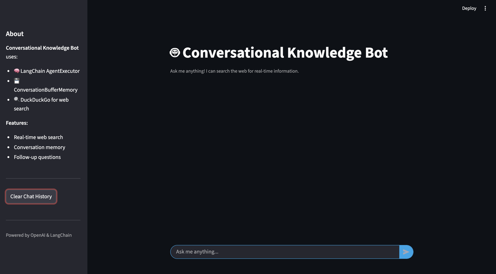
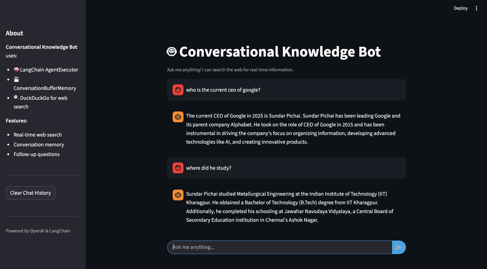

# Conversational Knowledge Bot

A Streamlit-based chatbot that uses LangChain AgentExecutor with ConversationBufferMemory to provide real-time, factual information while maintaining conversation context.

## Features

- **Conversation Memory**: Uses LangChain's `ConversationBufferMemory` to remember previous conversations and maintain context across follow-up questions
- **Real-time Web Search**: Integrates DuckDuckGo search (via `ddgs` library) to fetch current, factual information
- **Contextual Responses**: Handles follow-up questions by understanding conversation history (e.g., "Who is the CEO of OpenAI?" followed by "Where did he study?")
- **Streamlit UI**: Clean, interactive chat interface with custom styling

## Architecture

```
┌─────────────────────────────────────────────────────────────┐
│                    Streamlit Chat UI                        │
└─────────────────────────┬───────────────────────────────────┘
                          │
                          ▼
┌─────────────────────────────────────────────────────────────┐
│                   LangChain AgentExecutor                   │
│  ┌───────────────────────────────────────────────────────┐  │
│  │              ConversationBufferMemory                 │  │
│  │         (Stores chat history for context)             │  │
│  └───────────────────────────────────────────────────────┘  │
│  ┌───────────────────────────────────────────────────────┐  │
│  │           OpenAI Functions Agent (GPT-3.5)            │  │
│  │    (Decides when to search vs answer directly)        │  │
│  └───────────────────────────────────────────────────────┘  │
└─────────────────────────┬───────────────────────────────────┘
                          │
                          ▼
┌─────────────────────────────────────────────────────────────┐
│                    DuckDuckGo Search Tool                   │
│         (News + Web results for comprehensive data)         │
└─────────────────────────────────────────────────────────────┘
```

### Components

| Component | Purpose |
|-----------|---------|
| **AgentExecutor** | Orchestrates the conversation flow, deciding when to use tools |
| **ConversationBufferMemory** | Stores complete chat history for context-aware responses |
| **ChatOpenAI (GPT-3.5-turbo)** | LLM for understanding queries and generating responses |
| **DuckDuckGo Search Tool** | Fetches real-time news and web results |

### Memory Design

The bot uses `ConversationBufferMemory` which:
- Stores the full conversation history as messages
- Automatically injects chat history into every prompt
- Enables the bot to understand pronoun references (e.g., "he", "she", "it") in follow-up questions
- Persists within a session; cleared when the browser is refreshed or "Clear Chat History" is clicked

## Setup Instructions

### Prerequisites

- Python 3.9+
- OpenAI API key ([Get one here](https://platform.openai.com/api-keys))

### Installation

1. **Clone the repository**
   ```bash
   git clone https://github.com/nikhilvarma03/Soulpage-genai-assignment-Nikhil.git
   cd Soulpage-genai-assignment-Nikhil
   ```

2. **Create a virtual environment**
   ```bash
   python -m venv .venv
   source .venv/bin/activate  # On Windows: .venv\Scripts\activate
   ```

3. **Install dependencies**
   ```bash
   pip install -r requirements.txt
   ```

4. **Configure API key**

   Create a `.env` file in the project root:
   ```bash
   cp .env.example .env
   ```

   Edit `.env` and add your OpenAI API key:
   ```
   OPENAI_API_KEY=your_openai_api_key_here
   ```

### Running the Application

```bash
streamlit run app.py
```

The application will open in your browser at `http://localhost:8501`

## Usage

1. Type your question in the chat input at the bottom
2. The bot will search the web if needed and provide a factual response
3. Ask follow-up questions that reference previous context
4. Use the "Clear Chat History" button in the sidebar to start fresh

## Screenshots

### Chat Interface


### Conversation with Follow-up Questions


## Sample Chat Logs

### Example 1: Factual Query with Follow-up (Context Awareness)

```
User: who is the current ceo of google?

Bot: The current CEO of Google in 2025 is Sundar Pichai. Sundar Pichai has been
     leading Google and its parent company Alphabet. He took on the role of CEO
     of Google in 2015 and has been instrumental in driving the company's focus
     on organizing information, developing advanced technologies like AI, and
     creating innovative products.

User: where did he study?

Bot: Sundar Pichai pursued his education at various institutions. He earned a
     Bachelor of Technology (B.Tech) degree in metallurgical engineering from
     the Indian Institute of Technology (IIT) Kharagpur. Following that, he
     obtained a Master of Science (MS) degree in materials science and
     engineering from Stanford University. Additionally, he furthered his
     education by completing a Master of Business Administration (MBA) from
     the Wharton School of the University of Pennsylvania.
```

> **Note:** The bot correctly understood that "he" in the follow-up question refers to Sundar Pichai from the previous conversation, demonstrating the ConversationBufferMemory in action.

### Example 2: Current Events Query

```
User: Who won the latest FIFA World Cup?

Bot: Argentina won the 2022 FIFA World Cup, which was held in Qatar. They
     defeated France in a thrilling final that ended 3-3 after extra time,
     with Argentina winning 4-2 on penalties. Lionel Messi led Argentina to
     their third World Cup title.

User: Who scored the goals for France?

Bot: Kylian Mbappé scored all three goals for France in the 2022 World Cup
     final against Argentina. He became only the second player to score a
     hat-trick in a World Cup final.
```

### Example 3: General Knowledge with Context

```
User: What is the capital of Japan?

Bot: The capital of Japan is Tokyo. It's the most populous metropolitan area
     in the world and serves as Japan's political, economic, and cultural center.

User: What's the population there?

Bot: The Greater Tokyo Area has a population of approximately 37-38 million
     people, making it the world's most populous metropolitan area.
```

## Project Structure

```
Soulpage-genai-assignment-Nikhil/
├── app.py              # Main Streamlit application
├── requirements.txt    # Python dependencies
├── .env.example        # Example environment variables
├── .env                # Your API keys (not tracked in git)
├── .gitignore          # Git ignore rules
├── README.md           # This file
└── screenshots/        # Demo screenshots
    ├── chat_demo.png
    └── interface.png
```

## Dependencies

| Package | Version | Purpose |
|---------|---------|---------|
| langchain | 0.1.20 | Agent framework and memory components |
| langchain-openai | 0.1.7 | OpenAI integration for LangChain |
| streamlit | >=1.30.0 | Web UI framework |
| python-dotenv | >=1.0.0 | Environment variable management |
| ddgs | >=6.0.0 | DuckDuckGo search API wrapper |

## How It Works

1. **User Input**: User types a question in the Streamlit chat interface
2. **Agent Decision**: The AgentExecutor analyzes the query and decides whether to:
   - Use the Search tool for factual/current information
   - Respond directly for greetings or simple queries
3. **Search Execution**: If needed, the DuckDuckGo tool searches both news and web results
4. **Response Generation**: The LLM synthesizes search results into a coherent answer
5. **Memory Update**: The conversation is stored in `ConversationBufferMemory`
6. **Context Awareness**: Future queries leverage the stored conversation history

## Acknowledgments

- Built with [LangChain](https://langchain.com/)
- UI powered by [Streamlit](https://streamlit.io/)
- Search provided by [DuckDuckGo](https://duckduckgo.com/)
